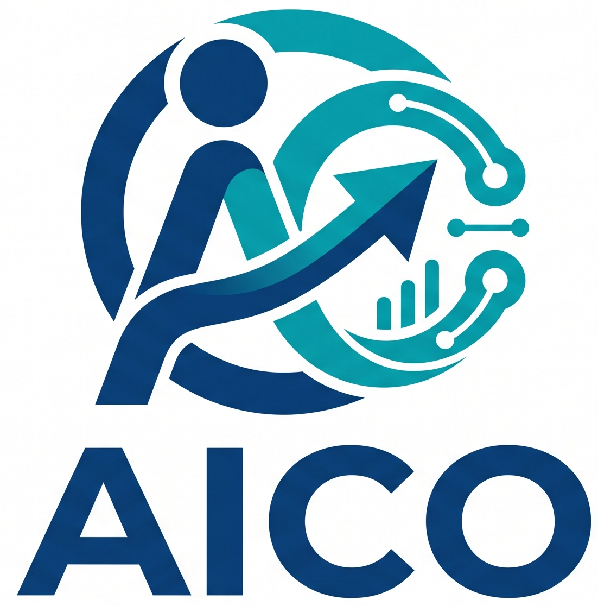

<h1 align="center">
  
</h1>

<p align="center">
  <b>AI-human Alignment and Cooperation: enabling AI to learn cooperation through long-term alignment</b>
</p>

<p align="center">
  English | <a href="./README_zh.md">简体中文</a>
</p>

<p align="center">
  <b>Version:</b> v0.1.0-alpha &nbsp; | &nbsp;
  <b>Status:</b> Active refactor in progress &nbsp; | &nbsp;
  <b>Technical Report:</b> Coming soon
</p>

AICO stands for **AI-human Alignment and Cooperation**. It does not simply explore how to make AI "remember more things"; it explores how AI can gradually align with people through long-term interaction, and then form more natural, reliable, and context-aware cooperation on top of that alignment.

Our vision is to move AI from a tool that only replies instantly toward a collaborator that can understand people, relationships, goals, and long-term tasks shared with either personal users or professional experts. AICO focuses not only on memory storage, but on alignment and the cooperative interaction that follows: AI should know who it is serving, who it is currently interacting with, what the current relationship and goal are, and what expression or action is more appropriate next.

---

## Why AICO

Existing AI assistants often treat memory and historical interactions primarily as ways to augment context. AICO explores a different direction: AI should form continuous alignment with people through long-term interaction, and then enter a cooperative state based on that alignment. For personal users, it needs to understand the user themself, their relationship network, and their everyday expression strategies. For experts, it needs to learn the expert's professional logic, service process, and decision-making style.

```text
Long-term interaction
  -> AI-human alignment
  -> personal or expert cooperation
  -> relationship-aware context
  -> strategy-guided dialogue
  -> feedback-driven evolution
```

AICO focuses on four questions:

| Question | Meaning |
|---|---|
| Who is the aligned subject? | The user themself in PERSONAL mode, or the expert in EXPERT mode. |
| Who is the current interaction partner? | A friend, family member, colleague, self-dialogue partner, or client. |
| What is the current topic and multi-turn purpose? | The dynamic topic, intent, relation context, and dialogue stage. |
| How should AI cooperate and iterate? | Profiles, relationship graph, knowledge, strategy trees, and confirmation records are continuously updated during cooperation. |

---

## Core Idea

AICO is built around an "alignment-cooperation-iteration" loop: the system first updates its understanding of people from interaction, then reads back relevant context in the next interaction to support more appropriate replies, suggestions, or expert decisions.

```text
WRITE -- update alignment state                     READ -- generate aligned context
──────────────────────────────────────              ─────────────────────────────────────
chat message   -> structured extraction             user query     -> context routing
feedback       -> patch + merge                     relationship   -> subgraph retrieval
expert edit    -> confirmation record               topic          -> tree selection
interaction    -> graph / tree evolution            strategy node  -> response guidance
```

### Write

1. Normalize the mode, aligned subject, interaction partner, conversation, and message.
2. Extract dynamic topics from dialogue instead of selecting from fixed scene labels.
3. Update personal, expert, client-service, and relationship states through structured patches.
4. Select, reuse, extend, or create a strategy tree for the current topic and relationship context.
5. Record confirmation sources from AI, user, expert, or system.

### Read

1. Retrieve the aligned subject profile.
2. Retrieve the current topic and related strategy tree.
3. In PERSONAL mode, retrieve the owner-private relationship subgraph around the current partner.
4. In EXPERT mode, retrieve the expert profile and client service profile.
5. Build compact context for response generation or expert decision support.

---

## Two Alignment Modes

| Mode | Aligned Subject | Interaction Partner | Purpose |
|---|---|---|---|
| PERSONAL | The user themself | Self, friends, family, colleagues, other people | Learn the user's identity, preferences, memories, relationship network, and everyday dialogue strategies. |
| EXPERT | The expert | Client | Align with the expert's logic, style, knowledge structure, decision tree, and service workflow. |

In EXPERT mode, the client is modeled as a service context for better expert-side replies. The client is not the long-term aligned subject.

---

## What AICO Builds

| Layer | Meaning | Used for |
|---|---|---|
| Personal Profile | Stable and dynamic profile of the user | Long-term personal alignment |
| Expert Profile | Expert style, school, knowledge structure, preferences | Expert logic alignment |
| Client Service Profile | Client case context, current need, risk signals, communication style | Supporting expert replies |
| Relationship Graph | Owner-private graph of people, relationships, events, constraints, and strategies | Reading relationship context before replying |
| Topic Graph | Dynamic semantic graph of extracted topics | Reuse, extend, or create strategy trees |
| Strategy Tree | Macro-level dialogue logic tree | Organizing multi-turn conversation flow |
| RAG Memory | Professional knowledge, personal memory, relationship memory, historical strategy | Compact retrieval for generation |
| Confirmation Records | AI/user/expert/system confirmation source | Traceability, revision, and governance |

---

## Owner-private Relationship Graph

AICO's relationship graph is not a global social graph. Each user owns a private graph built from their own conversations.

For user `me`, AICO may build:

```text
me
├── A
│   ├── A's parent
│   └── A's colleague
├── B
│   └── B's mother
└── C
```

When `me` chats with `A`, AICO retrieves a local subgraph instead of the whole graph.

| Retrieved Context | Why |
|---|---|
| Direct `me-A` edge | Relationship state, events, trust, tension |
| Person nodes for `me` and `A` | Profiles, preferences, constraints |
| Topic-relevant one-hop or two-hop relations | Background people and indirect context |
| Strategy implications | How relationship should affect the reply |

AICO's rule of thumb:

> The LLM proposes what should be updated; the system controls evidence, merging, deduplication, confidence, permissions, and persistence.

---

## Current Features

| Feature | Status |
|---|---|
| PERSONAL and EXPERT mode separation | Implemented in algorithm layer and frontend routes |
| Dynamic topic extraction | LLM-compatible extractor with local fallback |
| Topic graph reuse / merge / create | Implemented |
| Strategy tree runtime | First executable version |
| Owner-private relationship graph | First version implemented |
| Multi-source RAG | Supports knowledge, personal memory, relationship memory, strategy memory, expert profile, and client service profile |
| Expert/client frontend structure | April frontend retained and extended |
| Java alignment endpoints | Extended with AICO state, client service profile, and relationship edge details |
| Technical report | Coming soon |

---

## Repository Layout

```text
aico/
├── api/                 # Shared protocols and AICOOrchestrator entry point
├── alignment/           # Topic extraction, topic graph, vector similarity, iteration jobs
├── perception/          # Profiles, personal state, and relationship graph
├── decision/            # Thought tree and strategy tree runtime
├── knowledge/           # Retrieval and multi-source RAG
├── evaluation/          # Response and feedback evaluation
├── generation/          # Prompt and response generation
├── backend/             # Spring Boot backend extended from April
├── frontend/            # Vue frontend extended from April
├── algorithm/           # Preserved and reconstructed algorithm assets
├── storage/             # JSON state store for current development
└── tests/               # Python tests
```

---

## Quick Start

### Python Environment

AICO uses a dedicated conda environment named `aico`.

```powershell
conda env create -f environment.yml
conda activate aico
python -m pip install -e .
```

Run Python tests:

```powershell
python -m unittest discover -s tests
```

Expected current result:

```text
Ran 7 tests
OK
```

### Python Example

```python
from aico import AICOOrchestrator
from aico.api.schemas import AICOTurnInput, ClientMessage, InteractionMode

orchestrator = AICOOrchestrator()

output = orchestrator.process_client_message(
    AICOTurnInput(
        interaction_mode=InteractionMode.PERSONAL,
        counterpart_id="A",
        message=ClientMessage(
            client_id="user_1",
            conversation_id="conv_personal_A",
            text="I want to contact A again, but I do not want to pressure him.",
            metadata={"relationship_type": "friend"},
        ),
    )
)

print(output.response.text)
print(output.response.metadata["active_relationship_subgraph"])
```

### Frontend

```powershell
cd frontend
npm install
npm run dev
```

| Route | Meaning |
|---|---|
| `/personal` | PERSONAL entry |
| `/personal-workbench` | Personal alignment workbench |
| `/expert` | EXPERT entry |
| `/expert-chat` | Expert workspace |
| `/parent-chat` | Lightweight client chat |
| `/decision-tree` | Strategy tree editor |
| `/aico-alignment` | Alignment state viewer |

### Backend

```powershell
cd backend
mvn spring-boot:run
```

| Method | Endpoint | Description |
|---|---|---|
| POST | `/api/aico/alignment/turns` | Record a turn and update alignment state |
| GET | `/api/aico/alignment/users/{userId}/state` | Get aligned subject state |
| GET | `/api/aico/alignment/relationships` | Get PERSONAL relationship state |
| POST | `/api/aico/alignment/feedback` | Record user or expert feedback |

---

## LLM Configuration

Topic and relationship extraction are designed around an OpenAI-compatible chat endpoint. If no endpoint is configured, AICO uses conservative local fallback logic so tests and offline development remain runnable.

```powershell
$env:AICO_LLM_ENDPOINT="http://localhost:11434/v1/chat/completions"
$env:AICO_LLM_API_KEY="local-dev-key"
$env:AICO_LLM_MODEL="your-local-model"
```

Embedding currently uses a deterministic local implementation for development and tests. It can later be replaced with a production embedding provider.

---

## Roadmap

| Area | Next Step |
|---|---|
| Technical report | Release AICO technical report and architecture diagrams |
| Relationship graph UI | Click an edge to inspect people, events, evidence, constraints, and confirmation status |
| Strategy tree executor | Tighten node transition control and bind traces to real conversations |
| Expert confirmation workflow | Complete candidate topic/tree/node confirmation in expert workbench |
| Persistent backend | Move JSON state toward database or event-stream persistence |
| LLM extraction | Replace local fallback with stronger structured extraction and production embeddings |

---

## License

AICO is released under the [GNU Affero General Public License v3.0](./LICENSE) (AGPL-3.0).
