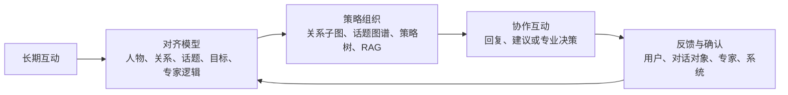

<h1 align="center">
  
</h1>

<p align="center">
  <b>AI-human Alignment and Cooperation：让 AI 在长期对齐中学会与人协作</b>
</p>

<p align="center">
  <a href="./README.md">English</a> | 简体中文
</p>

<p align="center">
  <b>版本：</b> v0.1.0-alpha &nbsp; | &nbsp;
  <b>状态：</b> 正在重构中 &nbsp; | &nbsp;
  <b>技术报告：</b> 即将发布
</p>

AICO，**AI-human Alignment and Cooperation**，是一个探索长期人机协作的开源研究框架。

它关注的不只是让 AI 保存更多历史信息，而是让 AI 在持续互动中逐步学会如何理解一个人、如何理解人与人之间的关系，以及在不同目标和情境下如何更恰当地回应、协作与行动。

对 AICO 而言，长期交互不是被动累积的聊天记录，而是一个持续演化的对齐过程：AI 需要知道自己在与谁共同工作、此刻正在和谁互动、当前话题与关系意味着什么，以及一段多轮对话应当如何被组织和推进。个人模式中，AICO 服务于用户自身及其关系世界；专家模式中，AICO 对齐专家的专业逻辑、服务方式与决策过程，并辅助其与 client 互动。

---

## 为什么做 AICO

许多 AI 系统已经能够保存偏好、提取事实、检索历史，或将长期记忆写入上下文。AICO 希望再向前一步：让这些长期信息参与对话的判断与组织，使 AI 不只知道过去发生过什么，也能理解此刻该如何与人协作。

## AICO 想带来的变化

| 方向 | AICO 所追求的能力 |
|---|---|
| `01` 从事实连续性，走向行为连续性 | AI 不只记得“对方喜欢简洁”，还会结合关系阶段、当前话题、未说出口的互动目的，选择更合适的语气、推进速度和表达边界。 |
| `02` 从单轮相关性，走向多轮策略性 | 当一段对话有阶段和目的时，AI 不只是逐句回答，而是能沿策略树组织对话：理解背景、建立共识、进入核心诉求，并根据真实反馈调整路径。 |
| `03` 从静态个性化，走向可协商的共同演化 | 对齐不是 AI 私自给人下定义。个人模式由 AI、用户、对话对象反馈和互动结果共同校准；专家模式由专家拥有对逻辑树、画像与规则的最终修改权。 |
| `04` 从零散记忆，走向关系世界模型 | 用户与不同对象的互动共同形成私有关系图谱。与 A 对话时，系统读取的是与 A 相关、可传导的局部关系上下文，而不是笼统塞入全部历史。 |

## 从对齐到协作



这个循环将长期互动转化为下一次协作的依据。AICO 关注四个问题：被对齐的主体是谁、当前正在和谁互动、当前 topic 与多轮对话目的是什么，以及 AI 如何在明确权限与确认来源的前提下持续协作和迭代。

---

## 两种对齐模式

| 模式 | 被对齐主体 | 交互对象 | 目标 |
|---|---|---|---|
| PERSONAL | 个人用户自己 | 自己、朋友、家人、同事、其他人 | 学习用户本人、偏好、记忆、关系网络和日常对话策略。 |
| EXPERT | 专家 | client | 对齐专家逻辑、风格、知识结构、决策树和服务流程。 |

在 EXPERT 模式下，client 会被建模为“服务上下文”，用于辅助专家回复；但 client 不是长期对齐主体。

---

## AICO 构建什么

| 层 | 含义 | 用途 |
|---|---|---|
| 个人画像 | 用户稳定画像与动态状态 | 个人长期对齐 |
| 专家画像 | 专家风格、流派、知识结构、偏好 | 专家逻辑对齐 |
| Client 服务画像 | client 案例背景、当前需求、风险信号、沟通风格 | 辅助专家回复 |
| 关系图谱 | 用户私有的人物、关系、事件、边界与策略网络 | 回复前读取关系上下文 |
| 话题图谱 | 动态生成的语义话题图谱 | 决定复用、扩展或新建策略树 |
| 策略树 | 宏观多轮对话逻辑树 | 组织多轮对话流程 |
| 检索记忆 | 专业知识、个人记忆、关系记忆、历史策略 | 为生成提供紧凑上下文 |
| 确认记录 | AI、用户、专家、系统确认来源 | 可追溯、可修订、可治理 |

---

## 用户私有关系图谱

AICO 的关系图谱不是全局社交图谱，而是每个用户基于自己所有聊天记录构建出来的私有关系网络。

例如，对用户 `me` 来说，AICO 可能构建：

```text
me
├── A
│   ├── A's parent
│   └── A's colleague
├── B
│   └── B's mother
└── C
```

当 `me` 和 `A` 聊天时，AICO 不会读取整张大图，而是检索局部关系子图。

| 检索上下文 | 作用 |
|---|---|
| `me-A` 直接关系边 | 关系状态、历史事件、信任与紧张程度 |
| `me` 和 `A` 的人物节点 | 人物画像、表达偏好、边界 |
| topic 相关一跳或二跳关系 | 背景人物与间接上下文 |
| 策略含义 | 关系如何影响回复策略 |

AICO 的基本原则：

> 大模型负责判断“本轮对话应该更新什么”；系统负责证据、合并、去重、置信度、权限和持久化。

---

## 当前功能

| 功能 | 状态 |
|---|---|
| PERSONAL 与 EXPERT 模式区分 | 已在算法层和前端路由中实现 |
| 动态 topic 抽取 | 支持 LLM-compatible 抽取器和本地 fallback |
| topic 图谱复用、合并、新建 | 已实现 |
| 策略树运行器 | 第一版可执行实现 |
| 用户私有关系图谱 | 第一版已实现 |
| 多源 RAG | 支持知识、个人记忆、关系记忆、策略记忆、专家画像和 client 服务画像 |
| 专家端与 client 端结构 | 保留并扩展 April 前端 |
| Java 对齐接口 | 已扩展 AICO 状态、client 服务画像和关系边详情 |
| 技术报告 | 即将发布 |

---

## 仓库结构

```text
aico/
├── api/                 # 共享协议与 AICOOrchestrator 主入口
├── alignment/           # topic 抽取、topic 图谱、向量相似度与迭代任务
├── perception/          # 画像、个人状态与关系图谱
├── decision/            # 思维树与策略树运行器
├── knowledge/           # 检索与多源 RAG
├── evaluation/          # 回复与反馈评估
├── generation/          # prompt 与回复生成
├── backend/             # 从 April 扩展的 Spring Boot 后端
├── frontend/            # 从 April 扩展的 Vue 前端
├── algorithm/           # 保留与重构的算法资产
├── storage/             # 当前开发用 JSON 状态存储
└── tests/               # Python 测试
```

---

## 快速开始

### Python 环境

AICO 推荐使用名为 `aico` 的独立 conda 环境。

```powershell
conda env create -f environment.yml
conda activate aico
python -m pip install -e .
```

运行 Python 测试：

```powershell
python -m unittest discover -s tests
```

当前预期结果：

```text
Ran 7 tests
OK
```

### Python 示例

```python
from aico import AICOOrchestrator
from aico.api.schemas import AICOTurnInput, ClientMessage, InteractionMode

orchestrator = AICOOrchestrator()

output = orchestrator.process_client_message(
    AICOTurnInput(
        interaction_mode=InteractionMode.PERSONAL,
        counterpart_id="A",
        message=ClientMessage(
            client_id="user_1",
            conversation_id="conv_personal_A",
            text="I want to contact A again, but I do not want to pressure him.",
            metadata={"relationship_type": "friend"},
        ),
    )
)

print(output.response.text)
print(output.response.metadata["active_relationship_subgraph"])
```

### 前端

```powershell
cd frontend
npm install
npm run dev
```

| 路由 | 含义 |
|---|---|
| `/personal` | 个人模式入口 |
| `/personal-workbench` | 个人对齐工作台 |
| `/expert` | 专家模式入口 |
| `/expert-chat` | 专家工作台 |
| `/parent-chat` | client 轻量聊天端 |
| `/decision-tree` | 策略树编辑器 |
| `/aico-alignment` | 对齐状态查看页 |

### 后端

```powershell
cd backend
mvn spring-boot:run
```

| Method | Endpoint | 说明 |
|---|---|---|
| POST | `/api/aico/alignment/turns` | 记录一轮对话并更新对齐状态 |
| GET | `/api/aico/alignment/users/{userId}/state` | 获取被对齐主体状态 |
| GET | `/api/aico/alignment/relationships` | 获取 PERSONAL 关系状态 |
| POST | `/api/aico/alignment/feedback` | 记录用户或专家反馈 |

---

## LLM 配置

Topic 与关系抽取器面向 OpenAI-compatible chat endpoint 设计。如果没有配置 endpoint，AICO 会使用保守的本地 fallback，以保证测试和离线开发可运行。

```powershell
$env:AICO_LLM_ENDPOINT="http://localhost:11434/v1/chat/completions"
$env:AICO_LLM_API_KEY="local-dev-key"
$env:AICO_LLM_MODEL="your-local-model"
```

当前 embedding 使用确定性本地实现，方便开发和测试。后续可以替换为生产级 embedding 服务。

---

## 路线图

| 方向 | 下一步 |
|---|---|
| 技术报告 | 发布 AICO 技术报告与架构图 |
| 关系图谱 UI | 支持点击关系边查看人物、事件、证据、边界与确认状态 |
| 策略树执行器 | 强化节点跳转控制，并绑定真实对话执行轨迹 |
| 专家确认工作流 | 完成专家工作台中的候选 topic、tree、node 确认流程 |
| 后端持久化 | 从 JSON 状态迁移到数据库或事件流 |
| LLM 抽取 | 用更强的结构化抽取与生产级 embedding 替换 fallback |


---

## 许可证

AICO 采用 [GNU Affero General Public License v3.0](./LICENSE)（AGPL-3.0）许可证发布。
